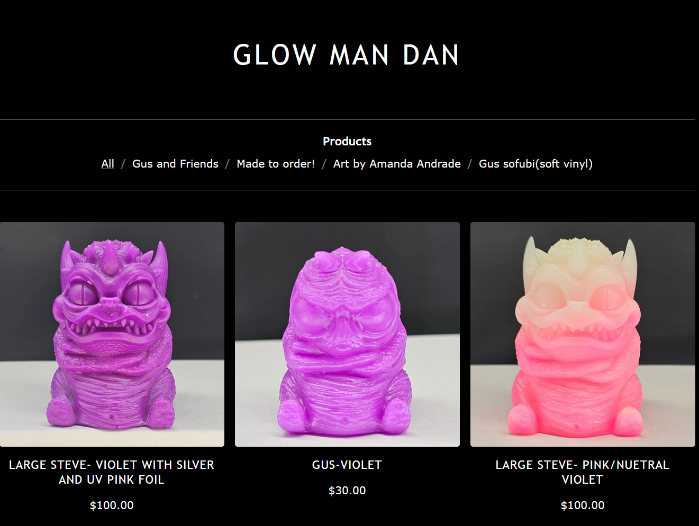

# Checkout-Automation-for-GlowManDan
GlowManDan is an online resin artist. Often he creates special, limited edition collectible items that will sell out almost immediately. Others are aware of this and often build their own bots to be the first to obtain these items. 

https://glowmandan.bigcartel.com/products 

A friend interested in the resin art collectibles (who knows that I'm a developer) asked me to build him a bot that he could use to be competitive in purchasing these items. I had just finished doing alot of similar automation for my internship, so I obliged at the opportunity to get more experience with the Python & the modules.

# Tools 
## Selenium
This script uses the webdriver inside Python's Selenium module find and interact with most of the UI elements. 

To run this script with a Chromium-based browser, one would need to install the Chrome webdriver .exe to the working directory: 

https://chromedriver.chromium.org/getting-started

I have a working .exe in the repo, but it may become out of date. So, it's best to just update it.

## PyAutoGUI
When getting into the PayPal portion of the automation (as it open in a separate window), I found it necessary to also leverage the PyAutoGUI module. One of it's features is to locate an image on a page and return it's centered coordinates.
The appropriate screenshots (at the time of creating this are already in the repo). More info about PyAutoGUI can be found here: 

https://pyautogui.readthedocs.io/

## Time
There were instances where Selenium is faster than the page load time and would not be able to locate the elements as they had not loaded in. Therefore, I artificially slowed down the script by introducing waiting time using time.sleep(). I find these times were the slowest I could get away with (the point of the script was to be fast), but they may need to be slowed down (or perhaps speed up) depending on your connection speed.

# Quirks
## UI Images  
The images for alot of the UI elements that PyAutoGUI needs were of course functional at the time. However, if PayPal or GlowManDan change any of these elements, the bot will not function. You can update the images by stepping through the purchasing process and retaking your own screenshots to replace mine. Simply use the same filenames to prevent having to edit the code.

## Website Changes
If GlowManDan changes his checkout process than this script will unfortunately not work. But considering he was using a third party to handle the checkout, it should remain the same for a while.

## Script End
The script can complete the purchase process beginning-to-end. However, during testing I left the final step commented out as to not actually buy anything. I felt it safer to leave the last step of the purchase in the user's hand in the final copy as well. However, it can easily be reactivated. The way I have it, at the end of the script, the bot will ask you if you wish to end the script.

## Information Entry
Initially, I had the bot prompt the user for entering information. However, if there were any typos, they would carry forward. That left me with 2 options, create an entire system to allow the user to edit their entries or just get the values and hardcode them in. Therefore, for my friend, I just had him give me the information to hardcode into the bot.

## Running the script
I ended up packaging the script into an .exe for my friend using PyInstaller. I was very quick and easy.

https://pyinstaller.org/en/stable/ 

But it would be more simple to just put in your infomation & run the script if you have Python installed.

